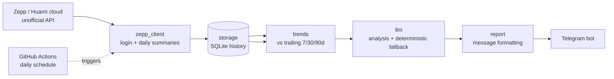

# WatchData — Daily Amazfit/Zepp Health Report


A Python app that runs **daily in GitHub Actions**, pulls your Amazfit/Zepp
health data, stores it in a versioned SQLite history, computes **trends vs your
previous 7 / 30 / 90 days**, asks an **LLM** to analyze the day, and delivers
the report to your **Telegram bot**.

## Quickstart

```bash
python -m venv .venv && .venv\Scripts\activate   # macOS/Linux: source .venv/bin/activate
pip install -r requirements.txt
cp .env.example .env        # Zepp credentials, Telegram token, LLM key
python check_setup.py       # validates config before the first real run
python -m watchdata.main daily
```

To run it hands-free, add the same values as repository secrets and the included
GitHub Actions workflow takes over on a daily schedule. `Dockerfile`, `fly.toml`
and `render.yaml` are included for container hosting.

It has two modes:

- **`daily`** — full report with trend comparisons (the scheduled job).
- **`prev-day`** — a standalone recap of a single day with no trends.

> ⚠️ Zepp has no official public API. This tool uses the same *unofficial*
> Huami cloud endpoints the Zepp mobile app uses. It works well in practice but
> can break if Zepp changes their backend, and the parsing is intentionally
> defensive (missing metrics simply show as `-`).

---

## How it works



| File | Responsibility |
|------|----------------|
| `watchdata/zepp_client.py` | Login to Huami cloud + download daily summaries |
| `watchdata/storage.py` | SQLite history (`data/health.db`) |
| `watchdata/trends.py` | Compare a day vs trailing 7/30/90-day averages |
| `watchdata/llm.py` | LLM analysis (OpenAI-compatible) + deterministic fallback |
| `watchdata/telegram_notifier.py` | Send the report to Telegram |
| `watchdata/report.py` | Format the message |
| `watchdata/main.py` | CLI / orchestration |

---

## Setup

### 1. Install

```bash
pip install -r requirements.txt
```

### 2. Configure

Copy `.env.example` to `.env` and fill it in:

```bash
cp .env.example .env
```

- **Zepp** — two auth modes, pick one:
  - **Token mode (recommended):** open
    [user.huami.com/privacy](https://user.huami.com/privacy/index.html), log in,
    open DevTools (F12) → Application → Cookies, copy the **`apptoken`** cookie
    into `ZEPP_APP_TOKEN`, and set `ZEPP_USER_ID` (from the Zepp app → Profile).
    This makes **no login calls**, so it can't be rate-limited or account-locked.
    Tokens last several weeks; re-extract when you get a `ZeppAuthError`.
  - **Credential mode (fallback):** set `ZEPP_EMAIL` + `ZEPP_PASSWORD`. Simpler,
    but the login endpoint rate-limits aggressively (HTTP 429) if hit repeatedly.

  Set `ZEPP_REGION` to `de` (Europe) or `us`; try the other if you get no data.
- **OpenAI**: an `OPENAI_API_KEY`. `LLM_MODEL` defaults to `gpt-4o-mini`. To use
  another OpenAI-compatible provider (OpenRouter, Groq, a local server), set
  `OPENAI_BASE_URL`.
- **Telegram**:
  1. Create a bot with [@BotFather](https://t.me/BotFather) → get the token.
  2. Send your bot any message.
  3. Open `https://api.telegram.org/bot<TOKEN>/getUpdates` and copy the
     `chat.id`.

### 3. First run / backfill

Populate history so trends have something to compare against, and preview the
report without sending it:

```bash
python -m watchdata.main --mode daily --backfill 90 --no-telegram
```

Then a real send:

```bash
python -m watchdata.main --mode daily
```

---

## CLI

```
python -m watchdata.main [--mode daily|prev-day] [--date YYYY-MM-DD]
                         [--backfill N] [--no-telegram] [--verbose]
```

| Flag | Description |
|------|-------------|
| `--mode` | `daily` (with trends) or `prev-day` (standalone recap). Default `daily`. |
| `--date` | Target day. Defaults to *yesterday* in your `TIMEZONE`. |
| `--backfill N` | Fetch/store the last `N` days first (use on first run). |
| `--no-telegram` | Print the report instead of sending (dry run). |
| `--verbose` | Debug logging. |

Examples:

```bash
# Yesterday's full report (default)
python -m watchdata.main

# Standalone recap of a specific day
python -m watchdata.main --mode prev-day --date 2026-08-20

# First-time history load, preview only
python -m watchdata.main --backfill 90 --no-telegram
```

---

## GitHub Actions (daily automation)

The workflow is at `.github/workflows/daily-report.yml`. It:

1. Runs every day at **06:30 UTC** (`workflow_dispatch` lets you run it manually
   and pick the mode / date / backfill).
2. Installs deps, runs the report, and **commits the updated `data/health.db`
   back to the repo** so history persists between runs.

### Configure secrets

In your repo: **Settings → Secrets and variables → Actions → New repository
secret**, add each of:

| Secret | Required | Notes |
|--------|----------|-------|
| `ZEPP_APP_TOKEN` | ✅ (token mode) | `apptoken` cookie from user.huami.com |
| `ZEPP_USER_ID` | ✅ (token mode) | your Zepp user id |
| `ZEPP_EMAIL` | ✅ (credential mode) | only if not using a token |
| `ZEPP_PASSWORD` | ✅ (credential mode) | only if not using a token |
| `ZEPP_REGION` | ✅ | `de` or `us` |
| `OPENAI_API_KEY` | ✅ | |
| `TELEGRAM_BOT_TOKEN` | ✅ | |
| `TELEGRAM_CHAT_ID` | ✅ | |
| `TIMEZONE` | optional | e.g. `Europe/Berlin` |
| `LLM_MODEL` | optional | defaults to `gpt-4o-mini` |
| `OPENAI_BASE_URL` | optional | for non-OpenAI providers |

Provide **either** `ZEPP_APP_TOKEN` + `ZEPP_USER_ID` (recommended) **or**
`ZEPP_EMAIL` + `ZEPP_PASSWORD`.

> The workflow needs `contents: write` permission (already set) so it can push
> the updated database. This is enabled by default for Actions in most repos.

### First run on GitHub

Trigger **Actions → Daily Health Report → Run workflow** with `backfill = 90` so
the first commit seeds ~3 months of history for good trend baselines.

---

## Notes & limitations

- **Unofficial API**: if Zepp changes their backend, `zepp_client.py` may need
  updates. Metric keys vary by device/firmware, so some fields may be empty.
- **Data freshness**: the report defaults to *yesterday* because same-day data
  is often incomplete until the watch syncs.
- **Privacy**: your credentials live only in `.env` (git-ignored) or GitHub
  Secrets. The committed `data/health.db` contains your metrics — keep the repo
  **private**.
- **Resilience**: if the LLM call fails, a deterministic summary is generated so
  you still get a report.
